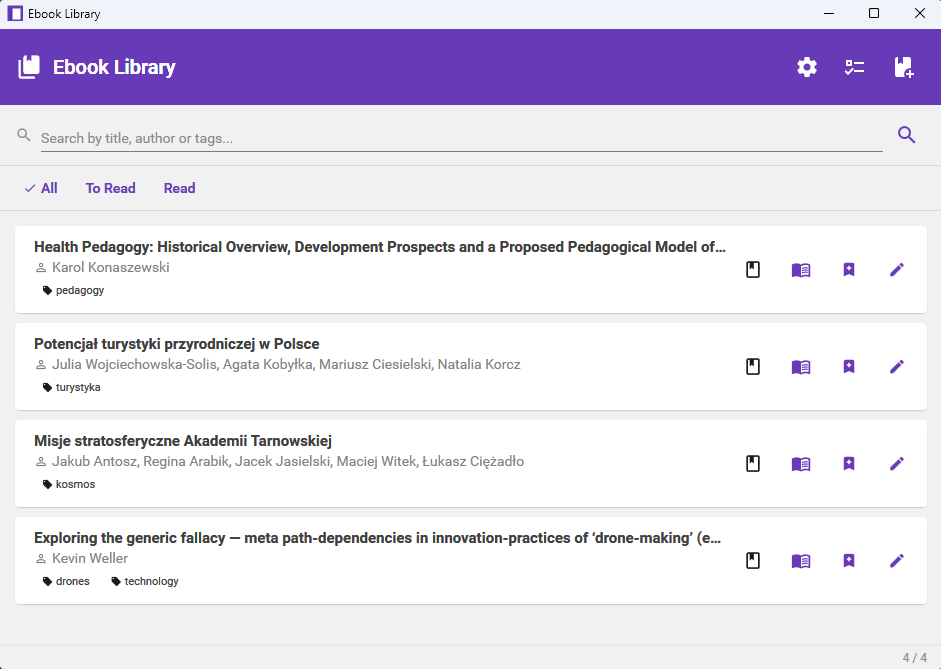
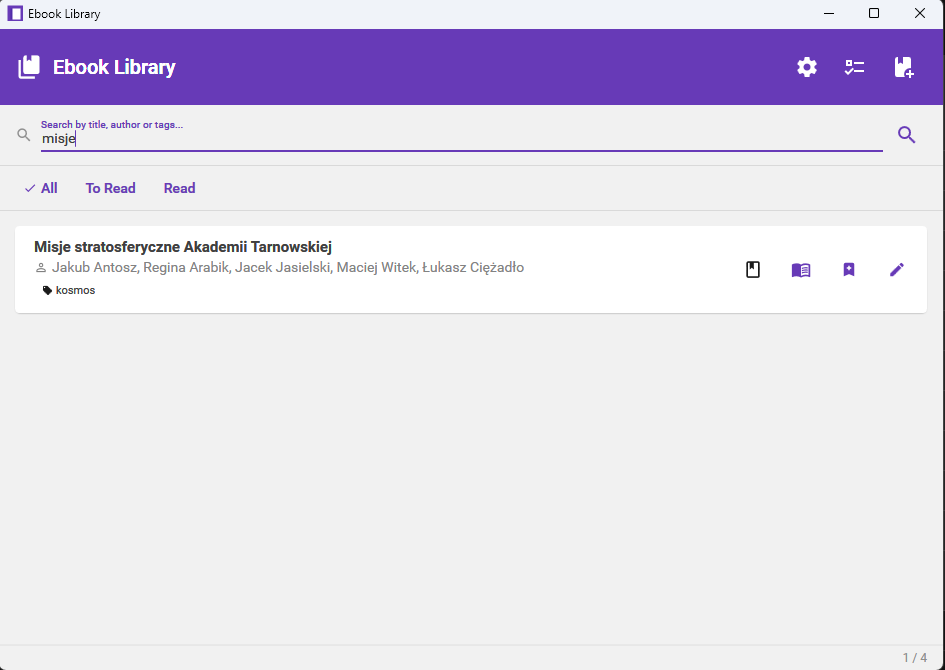
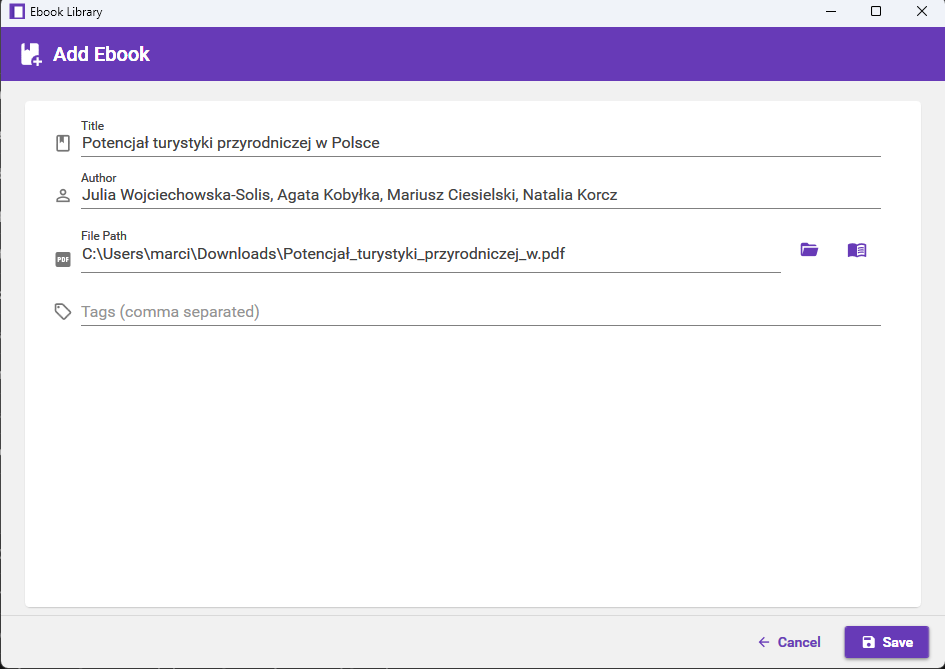
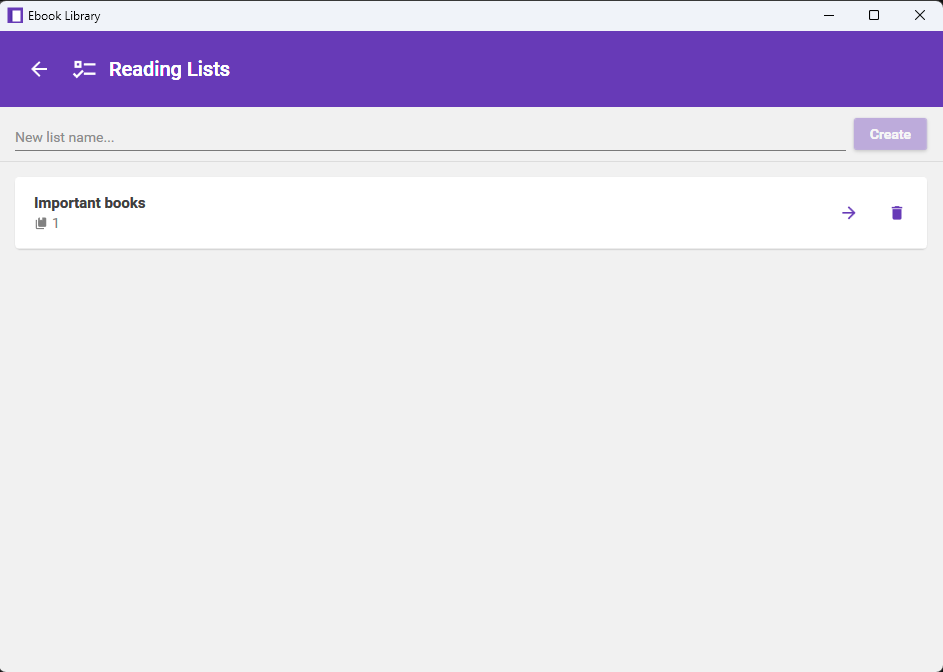
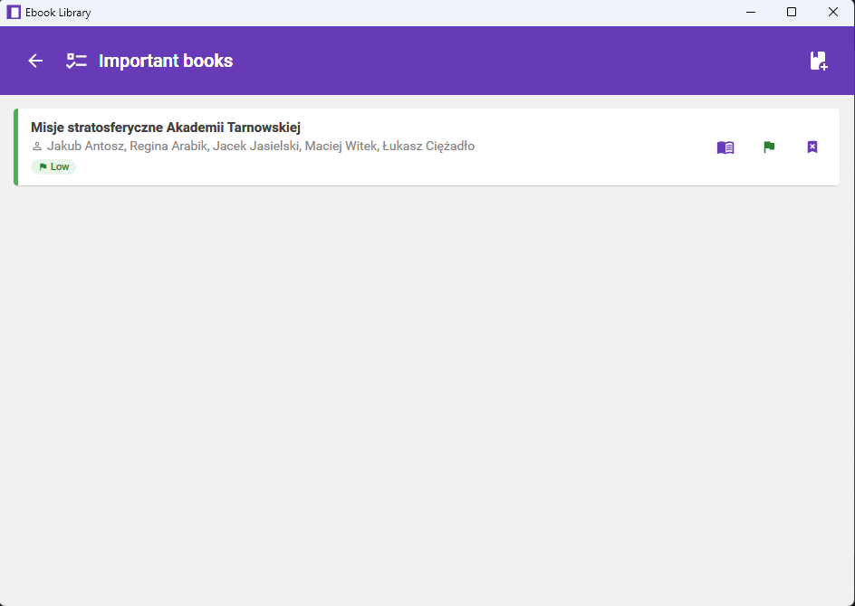
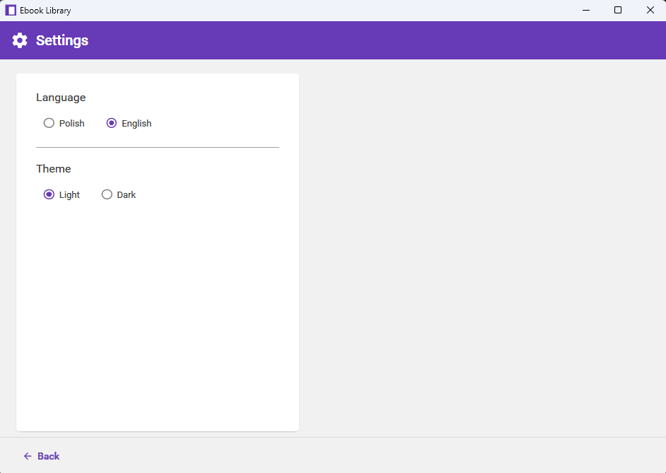

# 📚 EbookLibrary

A Windows desktop application for managing your ebook collection. Built with WPF and Material Design 3, it lets you organize, search, and track your reading progress with a clean, modern interface.



## Features

### 📖 Ebook Management
- Add ebooks with title, author, tags and file path
- Edit metadata and delete entries
- Open ebooks directly in your default reader
- Mark books as **read / unread** with one click
- Search by title, author or tags

### 🔖 Reading Lists
- Create named reading lists (e.g. *"Summer 2025"*, *"Tech books"*)
- Add books to lists directly from the main view or from within a list
- Assign priority per list: **Low / Medium / High**
- Cycle priority with a single click on the flag icon

### 🎨 Personalization
- **Light / Dark** theme switching
- **Polish / English** interface
- Settings persist across sessions

---

## Screenshots

### Book list


### Search & filters


### Add ebook


### Reading lists


### Reading list detail


### Settings


---

## Tech Stack

| Layer | Technology |
|-------|-----------|
| Framework | .NET 8, WPF |
| UI | [Material Design In XAML](http://materialdesigninxaml.net/) 5.3 |
| MVVM | [Caliburn.Micro](https://caliburnmicro.com/) 5.0 |
| Database | [LiteDB](https://www.litedb.org/) 5.0 (embedded NoSQL) |
| Tests | xUnit, NSubstitute |

---

## Getting Started

### Prerequisites
- Windows 10/11
- [.NET 8 Runtime](https://dotnet.microsoft.com/download/dotnet/8.0)

### Run from source

```bash
git clone https://github.com/letyshub/EbookLibrary.git
cd EbookLibrary
dotnet run --project src/EbookLibrary/EbookLibrary.csproj
```

### Build release

```bash
dotnet publish src/EbookLibrary/EbookLibrary.csproj -c Release -r win-x64 --self-contained
```

### Run tests

```bash
dotnet test
```

---

## Project Structure

```
src/EbookLibrary/
├── Models/          # Data models (Ebook, ReadingList)
├── ViewModels/      # MVVM ViewModels (Caliburn.Micro)
├── Views/           # XAML views
├── Services/        # Database, file and settings services
├── Messages/        # Event aggregator navigation messages
└── Resources/       # Localization strings (EN/PL)
```

---

## License

MIT © [letyshub](https://github.com/letyshub)
